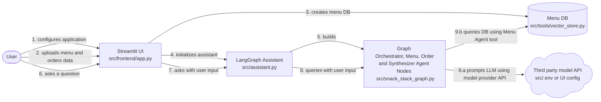
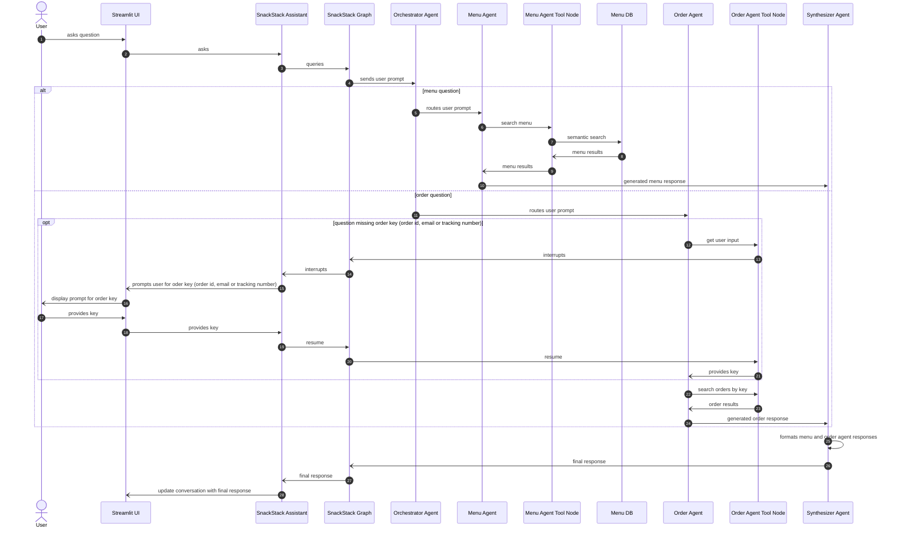

# Snack Stack AI Assisstant


> A voice enabled multi-agent food delivery assistent. It accepts queries through text or voice from a user. It specializes in menu searches and order status tracking

## Table of Contents
1. [The Problem](#the-problem)
2. [Solution Overview](#solution-overview)
3. [Who it is For and Use Cases](#who-it-is-for-and-use-cases)
4. [Architecture](#architecture)
5. [Tech Stack](#tech-stack)
6. [Quick Start](#-quick-start)
7. [Project Structure](#project-structure)

## The Problem
A restaurant has data on its menu and the orders and needs a way to search and answer customer questions about the menu and orders. 

## Solution Overview
A multi-agent food delivery and ordering assistent for a fictional company called SnackStack. It is build using LangGraph. 
The system performs the following operations:
1. Accepts natural language queries via text input (and optionally voice)
2. Routes queries to the correct specialist agent(s) using an LLM-powered orchestrator
3. Searches a menu catalog using semantic search (RAG with ChromaDB)
4. Looks up order status by Order ID, Tracking ID, or email
5. Asks the user for missing information when needed (Human-in-the-Loop)
6. Merges responses from multiple agents into a single friendly reply
7. Optionally supports voice input (Whisper STT) and voice output (OpenAI TTS)

## Who it is For and Use Cases
The SnackStack AI assistant can be used by the following people:

### 1. Restaurant Worker
Any worker at the restaurant that needs to answer customer questions regarding menu and order status. 
For example someone can call the restaurant looking for status on their order and a restaurant worker 
can quickly ask AI assistant for the answer.

### 2. Restaurant customer
Any potential customer can chat with the AI assistant to ask questions regarding menu and order status.
For example "What type of italian food can I order?"

### 3. (Bonus) Self-learner exploring LangGraph, LangChain and Streamlit UI
An engineer new to LangGraph graph engineering, LangChain agents or streamlit UI.
They can look at the following code
1. data/* menu and order mock data used for testing
2. src/agents/* contains the LangGraph nodes and LangChain agents being build and used.
3. src/frontend/* contains the streamlit UI application. (app.py is the main application entrypoint)
4. src/tools/* tools used for loading files, vector DB and order and menu agent tool nodes
5. src/snack_stack_graph.py contains the LangGraph graph building code
6. src/assistant.py contains the SnackStack assistant class used to power the UI chat assistant.

### 4. (Bonus) Possible extension into retail
It is not hard to imagine that this can be extended into any retail application by replacing menu for a restaurant
with a product database do for a retail store and food orders with orders for any products the store has to offer.

## Architecture
### High Level System
The high level data flow diagram depicts how user actions and provided data flow through the high level components of the system.


### Question Flowchart
The flow chart below shows what happens when a user asks a single question. 

>&#128161; Orchestrator routes to Menu and Order Agent in parrallel if user question contains request for both menu and orders agents



## Tech Stack

| Layer              | Tool                                                     | Why it is here                                                              |
| ------------------ | -------------------------------------------------------- | --------------------------------------------------------------------------- |
|UI                  | [Streamlit](https://streamlit.io)                        | Zero-boilerplate web app. One file, top to bottom.                          |
|Agent framework     | [LangChain](https://www.langchain.com)                   | Generic way of creating AI agents and tools. Supports OpenAI, Anthropic, Google and more |
|Agent orchestration | [LangGraph](https://docs.langchain.com/oss/python/langgraph/overview)| Orchestration framework and runtime for managing, build and deploying stateful agents|
|Vector DB           | [ChromaDB](https://docs.trychroma.com/) | Open source vector database supporting semantic and metadata search

## 🚀 Quick Start

### 1. Create a virtual environment (recommended)

**Windows (PowerShell):**
```powershell
py -m venv .venv
```

**macOS/Linux:**
```bash
python3 -m venv .venv
```

### 2. Activate the virtual environment

**Windows (PowerShell):**
```powershell
Set-ExecutionPolicy -Scope Process -ExecutionPolicy Bypass; .\.venv\Scripts\Activate.ps1
```

**Windows (CMD):**
```bat
.venv\Scripts\activate.bat
```

**macOS/Linux:**
```bash
source .venv/bin/activate
```

### 3. Install dependencies
```bash
pip install --upgrade pip
pip install -e .
```


### 4. Configure Model and Embeddings Provider

**Windows (PowerShell):**
```powershell
Copy-Item .env.example .env
```

**macOS/Linux:**
```bash
cp .env.example .env
```

Then edit `.env` and set model and embeddings config. For an example:
```env
MODEL_PROVIDER=anthropic
MODEL_API_KEY=your_anthropic_api_key
MODEL=anthropic/claude-haiku-4-5-20251001
EMBEDDINGS_MODEL_PROVIDER=huggingface
EMBEDDINGS_MODEL_API_KEY=your_hugging_face_api_key
EMBEDDINGS_MODEL=google/embeddinggemma-300m
```
>&#128161; Model providers are based on [LangChain providers](https://reference.langchain.com/python/langchain/chat_models/base/init_chat_model#parameters). Currently only anthropic and openai are tested. 

>&#128161; Embeddings providers are based on [LangChain providers](https://reference.langchain.com/python/langchain/embeddings/base/init_embeddings#parameters). Currently only hugging face and openai implemented.

To test your config see [unit tests](#6-Run-Tests)


### 5. Build and Install locally
#### 5.1 Regular install
```bash
python3 -m build
pip install .
```

#### 5.2 Editable install
Changes to source code reflect instantly with no re-install
```bash
python3 -m build
pip install -e .
```

### 6. Run Tests
#### 6.1 Test your configuration
This is a recommended test to ensure your .env is properly configured
```bash
pytest tests/tools/test_config.py
```

#### 6.2 Run All tests
```bash
pytest
```

### 7. Run Streamlit application
```
streamlit run src/frontend/app.py
```

## Project Structure
```
SNACK-STACK-AI/                   #entire application
  .github/workflows               #github repo actions or workflows
    python-app.yml                #python pull request action for building, testing and code coverage
  data/                           #contains sample data used by AI assisstant
    menu.json                     #sample menu items
    orders.json                   #sample orders
  src/                            #python source code
    agents/                       #python code related to LangGraph node, context schema and state
      __init__.py                 #package init file
      context_schema.py           #LangGraph runtime context schema defining shared objects used by the nodes (ie. llm, tools, etc...)
      menu_agent.py               #menu agent and prompt
      orchestrator.py             #orchestrator agent and prompt
      order_agent.py              #order agent and prompt
      state.py                    #the shared state that is passed between the LangGraph Nodes
      synthesizer.py              #synthesizer agent that puts together the output from menu and order agent
    frontend/                     #streamlit application
      components/                 #frontend components
        __init__.py               #package init file
        graph_containers.py       #reusable LangGraph graph nodes, state and events classes that initialize and populate streamlit containers.
        snack_stack_containers.py #concrete implementation for SnackStack AI graph containers
      pages/
        __init__.py               #package init file
        menu.py                   #page displaying SnackStack menu used by AI assistant
        chat.py                   #page with AI assistant conversation and Graph activity
        orders.py                 #page displaying SnackStack orders used by AI assistant
      utils/
        __init__.py               #package init file
        common.py                   #common methods and definitions
      __init__.py                 #package init file
      app.py                      #streamlit main page and app
    jupyter/                      #contains jupyter notebooks
      graph_test.ipynb            #jupyter notebook (playground) for testing the snack-stack-ai app
    testutils/                    #folder for unit testing utils and tools
      __init__.py                 #package init file
      common.py                   #common unit testing functions
    tools/                        #tools used for the agents to import sample data and config
      __init__.py                 #package init file
      common.py                   #common tools that can be used by any agent
      config.py                   #gets the embeddings and chat model from the config .env file
      menu.py                     #loads the menu sample items and provides the LangGraph menu search tool
      orders.py                   #loads the orders sample items and provides the LangGraph orders search tool
      vector_store.py             #Chroma DB store functionality for local persistence
    __init__.py                   #package init file
    assistant.py                  #defines the SnackStackAssistant
    snack_stack_graph.py          #the snack stack graph definition
  tests/                          #python unit tests using pytest
    agents/                       #agent unit tests 
      test_menu_agent.py          #menu agent tests
      test_orchestrator.py        #orchestrator agent tests
      test_order_agent.py         #order agent tests
      test_synthesizer.py         #synthesizer agent tests
    tools/                        #tools unit tests
      test_config.py              #config unit tests
      test_menu.py                #menu unit tests
      test_orders.py              #orders unit tests
      test_vector_store.py        #vector store unit tests
    test_snack_stack_graph.py     #snack stack graph tests
  .env.example                    #example config file
  .gitignore                      #git ignore file
  LICENSE                         #license information
  pyproject.toml                  #python project file
  README.md                       #this file 
```
